### Robot Line Follower
# Zawartość

1.  Uruchomienie programu Webots
    - a. Wymagania techniczne
    - b. Ścieżka pobierania
    - c. Ścieżka instalacji
1.  Uruchomienie programu Webots
1.	Utworzenie projektu świata Webots
    - a.	Inicjacja świata
      - i.	Utworzenie projektu nowego świata
      - ii.	Zapis projektu
    - b. Inicjacja planszy
      - i.	Konfiguracja RectangleArea
    - c. Inicjacja torów
      - i.	Utworzenie toru w programie Adobe Photoshop
      - ii.	Import utworzonego toru do Webots
    - d.	Inicjacja robota
      - i.	Wybór robota e-puck
1. 	Zaprogramowanie robota 
    -  a. Wybór czujników
       - i.	Dystansu
       - ii. Koloru
       - iii. Kamery
    - b.	Utworzenie kontrolera – controller
      - i.	Proces utworzenia kontrolera
      - ii.	Implementacja kodu
    - c.	Wykorzystanie zdefiniowanych funkcji robota
    - d.	Implementacja modułów
        - i.	Standardowa biblioteka C++
        - ii.	Dystansu
        - iii.	Led
        - iv.	Akcelerometr
        - v.	Kamera
        - vi.	Światła
        - vii.	Robota
        - viii.	Węzeł silnikowy
    - e.	Implementacja zmiennych i funkcji
    - i.	Poruszanie się robota w zależności od koloru linii
        - ii.	Poruszanie robota wspierane przez kamerę
5.	Dokumentacja
    - a.	Robot e-puck
    - b.	Webots

<br><br>
<font size="5"> 1. 	Instalacja programu Webots</font><br><br>
<font size="3"><b>a. Wymagania techniczne </b></font> <br>


Linux: Ubuntu Long Term Support (LTS), obecnie w wersji 18.04, RedHat, Mandrake,<br> Debian, Gentoo, Arch, SuSE i Slackware.<br> 
Windows: Windows 10 i Windows 8.1 (tylko wersje 64-bitowe).<br>
Mac: MacOS 10.15 „Catalina” i 10.14 „Mojave”.<br>
Procesor min. : 2 GHZ DUAL<br>
RAM min. : 2 GB 

<font size="3"><b>b. Ścieżka pobierania </font></b> <br>

Instalację należy wykonać przechodząć do przeglądarki internetowej (preferowany typ: Google Chrome) , następnie w pasku adresu umieścić odnośnik do strony:<br>
Link: https://cyberbotics.com/ <br><br>
Będąc na stronie producenta , wybieramy przycisk kierujący do listy rozwijanej:

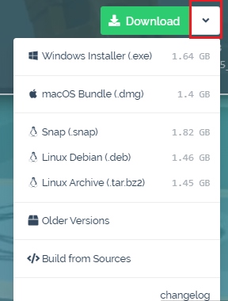 

Z listy rozwijanej wybierany system z którego korzysta nasz komputer.
Po wyborze systemu , zostaję uruchomiony proces pobierania aplikacji na komputer.


<font size="3"><b>c. Ścieżka instalacji </font></b> <br>
Intalacja programu przebiega stanardowo wbieramy, lokalizacje zapisu i klikamy install.


<font size="5 "> 2. Uruchomienie programu Weebots</font><br><br>
W momencie kiedy nasz program będzie już zainstalowany na komputerze. Będziemy mieli możliwość uruchomienia go z listy dostępnych aplikacji w systemie

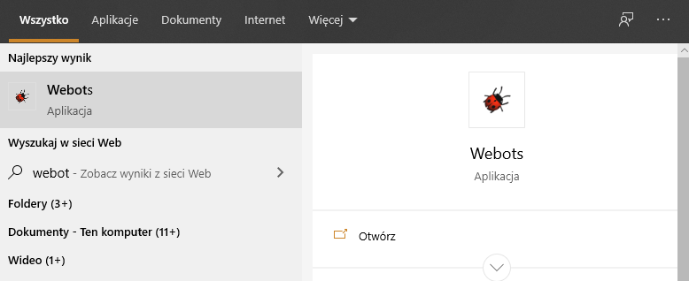


<font size="5"> 3. Utworzenie projektu świata Webots</font><br><br>
<font size="3"><b>a. Inicjajca świata </font></b> <br>

&nbsp;&nbsp;&nbsp;&nbsp;&nbsp;&nbsp;<font size="3"><b> i.	Utworzenie projektu nowego świata </font></b></p>

      Nowy świat tworzymy przez procedurę wyboru:
	  CTRL+SHIFT+N
 Opcjonalnym sposobem na utworzenie światu w aplikacji jest również wybór standardowej metody ścieżki:<br>
FILE -> New project<br>
Po wykonanu tej procedury otrzymamy widok:


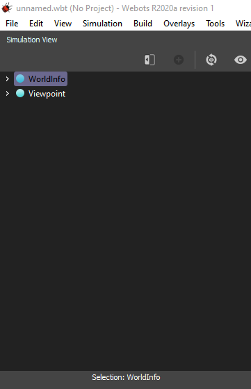

&nbsp;&nbsp;&nbsp;&nbsp;&nbsp;&nbsp;<font size="3"><b>ii.	Zapis projektu</font></b></p>
Zapis projektu wykonujemy przez procedurę zapisu:
CTRL+SHIFT+S
Opcjonalnym sposobem na zapis świata w aplikacji jest również wybór standardowej metody ścieżki:
<br> FILE -> Save project

<font size="3"><b>b. Inicjajca świata </font></b> <br>
&nbsp;&nbsp;&nbsp;&nbsp;&nbsp;&nbsp;<font size="3"><b>i.	Konfiguracja RectangleArea</font></b></p>
Plansza jest najważniejszym krokiem potrzebnym do wykonania po utworzeniu świata w programie. Aby tego dokonać będziemy musieli przejść procedurę implementacji dodatkowej zawartości z biblioteki szablonów którą udostępnia Webots. Jest to najprostsze, ale zarazem najlepsze rozwiązanie które oszczędza czas programiście.<br>
W utworzonym projekcie świata , przechodzimy do etapu wyboru szablonu:<br>
FILE -> Open Sample World<br> 
W tym momencie pojawia nam się okienko z możliwością wyboru interesującej nas kategorii<br>
Wybieramy:<br>
Robots-> gctronic -> e-puck -> e-puck.wbt

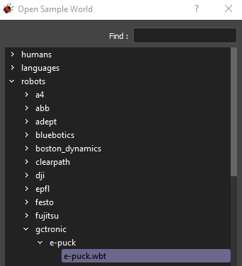<br>
W momencie uruchomienia szablonu , pojawi się poniższy schemat:

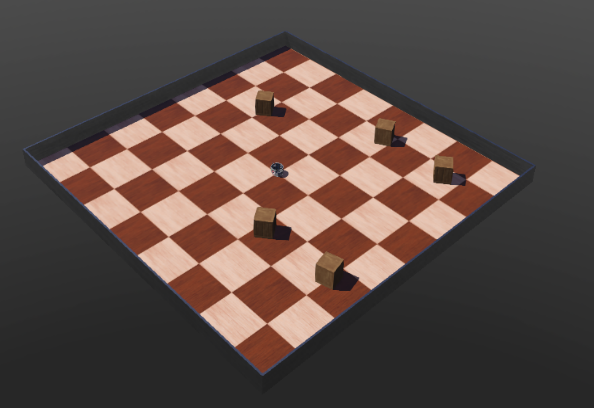<br><br>
W celu przygotowania planszy pod interesujące nas tory , będziemy musieli przejść etap oczyszczenia planszy z zbędnych materiałów które zostały zaimplementowane w schmecie tj. Box


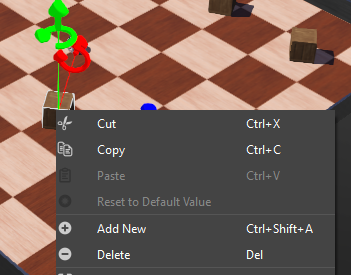<br><br>

Dokonamy tego klikając PPM (Prawym przyciskiem myszy) na dany element , a następnie wybierając opcję „Delete”.
Powyższą procedurę wykonujemy na każdym obiekcie który widnieję na planszy.
Po wykonaniu wszystkich kroków, nasza gotowa plansza powinna wyglądać w poniższy sposób


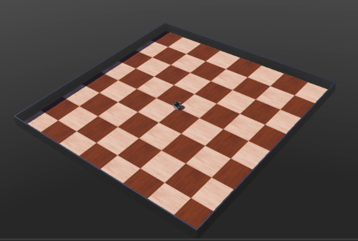<br>
Na końcowym etapie RectangleArea , powinna posiadać wszystkie niżej wymienione zdefiniowane metody:

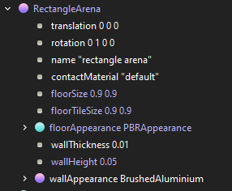<br>


<font size="3"><b>c. Inicjacja torów </font></b> <br>
&nbsp;&nbsp;&nbsp;&nbsp;&nbsp;&nbsp;<font size="3"><b>i.	Utworzenie toru w programie Adobe Photoshop</font></b></p>
Tor jazdy tworzymy w rozdzielczości nie mniejszej oraz nie większej niż:

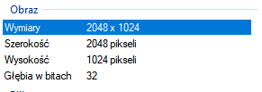


Jest to kluczowy element w momencie tworzenia toru , gdyż bazując na naszej powierzchni floor w RectangleArea musimy dostosować rozdzielczość wykonanego toru do powierzchni która została udostępniona w tym wypadku to rozmiar: 2048 x 1024 px.<br>
Tworzymy więc w programie projekt o powyższych rozmiarach z założenia tworząc tzw.<br> Background , tło naszego toru w kolorze białym. Używamy do tego dostępnych narzędzi typu:<br>
-Linia <br>
-Różdzka<br>
-Zaokrąglenie<br><br>
Alternatywą do tworzonego projektu może być również inny program graficzny który umożliwi wykonanie zadania.<br>
Gotowy plik zapisujemy zawsze jako jeden z dostępnych formatów:<br>
.png <br>
.jpg

W innym wypadku program Webots nie poprawnie zaimplementuję dane w systemie przez co wykonany tor może odbiegać od utworzonego np. po przez przekształcone, zdeformowane krzywe lub ucięcie kluczowych elementów.

&nbsp;&nbsp;&nbsp;&nbsp;&nbsp;&nbsp;<font size="3"><b>ii.	Import utworzonego toru do Webots</font></b></p>
Utworzony tor importujemy do programu jako metoda :

```python
baseColorMap ImageTexture
```

Z zagnieżdzonych dostępnych metod wybieramy funkcję:
url
A następnie definiujemy lokalizację wcześniej przygotowanego toru. Ważne , aby tor znajdował się w tym samym folderze w celu uniknięcia nie przyjemnych komplikacji wynikających z przypadkowego zagubienia pliku.<br><br>
Warto również wykonać kopię toru, gdyż funkcja nie zapamięta go w systemie i bazuję na nim w całym okresie działania programu.<br>
A następnie definiujemy lokalizację wcześniej przygotowanego toru. Ważne , aby tor znajdował się w tym samym folderze w celu uniknięcia nie przyjemnych komplikacji wynikających z przypadkowego zagubienia pliku.
Warto również wykonać kopię toru, gdyż funkcja nie zapamięta go w systemie i bazuję na nim w całym okresie działania programu.

&nbsp;&nbsp;&nbsp;&nbsp;&nbsp;&nbsp;<font size="3"><b>Załącznik 1:</font></b></p>

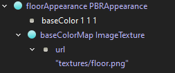

<font size="3"><b>d. Inicjacja Robota </font></b> <br>
&nbsp;&nbsp;&nbsp;&nbsp;&nbsp;&nbsp;<font size="3"><b>i.	Wybór robota e-puck</font></b></p>

Wybór robota jest kwestią sporną. W celu wykonania tego projektu został wybrany robot spełniający wszystkie kryteria umożliwiające wykonanie zadania poruszania się z dużą prędkościa w miejscach pozwalających na takie zachowanie.
E-Puck – to miniaturowy robot mobilny opracowany pierwotnie w EPFL do celów dydaktycznych przez projektantów odnoszącego sukcesy robota Khepera. Sprzęt i oprogramowanie e-pucka jest w pełni open source, zapewniając niski poziom dostępu do każdego urządzenia elektronicznego i oferując nieograniczone możliwości rozszerzenia.Model obejmuje obsługę silników kół różnicowych (enkodery są również symulowane jako czujniki położenia), czujniki podczerwieni do pomiaru odległości i światła, akcelerometr, kamera, 8 otaczających diod LED, diody LED nadwozia i przedniej, komunikacja Bluetooth (modelowany przy użyciu urządzeń Emiter / Receiver) i rozszerzenie czujników uziemienia. Inne urządzenia e-puck nie są jeszcze symulowane w bieżącym modelu.

W celu ręcznej implementacji robota, jesteśmy w stanie tego dokonać dodając go jako dodatkowa zawartość do naszej mapy.


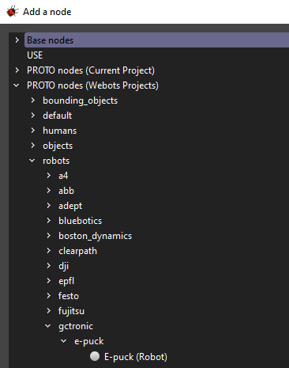<br>
<font size="5">4.	Zaprogramowanie robota</font><br><br>
<font size="3"><b>a.	Wybór czujników </font></b> <br>
Czujniki pełnią istotną rolę w funkcjonowaniu robotów. To dzięki nim jesteśmy w stanie skonfigurować robota pod takim zachowaniem jakie nas interesuję. Jesteśmy ograniczeni tylko do tych które są dostępne, dlatego też bardzo ważny jest wcześniejszy prawidłowy wybór robota, aby zapewnił nam odpowiednie zapotrzebowanie do naszych zadań.
&nbsp;&nbsp;&nbsp;&nbsp;&nbsp;&nbsp;<font size="3"><b>i.	Dystansu</font></b></p>
Czujnik dystansu można użyć do modelowania czujnika ogólnego, czujnika podczerwieni, czujnika sonaru lub dalmierza laserowego. Ta symulacja urządzenia jest wykonywana przez wykrywanie kolizji między jednym lub kilkoma promieniami czujnika i obiektami w otoczeniu. W przypadku typu ogólnego, sonaru i lasera kolizja zachodzi z obiektami ograniczającymi węzłów Solid, natomiast wykrywanie kolizji promieni podczerwonych wykorzystuje same węzły Solid.<br>
DistanceSensor można wyświetlić, sprawdzając menu Widok / Opcjonalne renderowanie / Pokaż promienie czujnika odległości. Przejście czerwono-zielone na promieniach wskazuje punkty przecięcia z ograniczającymi obiektami.
Funkcje jakie zostały użyte do inicjacji tego czujnika to:

```c++
wb_distance_sensor_enable – włącznik czujnika
wb_distance_sensor_disable – wyłącznik czujnika
wb_distance_sensor_get_sampling_period – odczyt pomiarów
wb_distance_sensor_get_value – odczyt wartości odległości
wb_distance_sensor_get_max_value – maksymalna wartość 
wb_distance_sensor_get_min_value – minimalna wartość 
wb_distance_sensor_get_aperture – odległość zwracana w radianach

```
```c++
wb_distance_sensor_get_aperture – odległość zwracana w radianach
```
    ta funkcja pozwala użytkownikowi odczytać typ czujnika odległości zdefiniowany w polu typu.

&nbsp;&nbsp;&nbsp;&nbsp;&nbsp;&nbsp;<font size="3"><b>ii.	Kamery</font></b></p>
Węzeł kamery służy do modelowania kamery pokładowej robota. Powstały obraz można wyświetlić w oknie 3D. W zależności od konfiguracji węzeł Camera może modelować kamerę liniową, typową kamerę RGB lub nawet rybie oko, które jest zniekształcone sferycznie.

Implementacja kamery:

```c++
void wb_camera_enable(WbDeviceTag tag, int sampling_period);
void wb_camera_disable(WbDeviceTag tag);
int wb_camera_get_sampling_period(WbDeviceTag tag);
```

<font size="3"><b>b.Utworzenie kontrolera – controller </font></b> <br>
&nbsp;&nbsp;&nbsp;&nbsp;&nbsp;&nbsp;<font size="3"><b>i.	Proces utworzenia kontrolera</font></b></p>

Kontroler odpowiada za sterowanie naszym robotem. W nim implementujemy język naszego kodu , środowisko IDE oraz unikalną nazwę. Dzięki czemu mamy skonfigurowany prawidłowo plik pod implementację pod danego robota. 
W celu utworzenia kontrolora robota, należy z paska menu wybrać opcję:
Wizards -> New Robot Controller…
Po wyborze powyższej opcji , otrzymamy widok kreatora która przeprowadzi nas przez proces utworzenia nowego kontrolera.


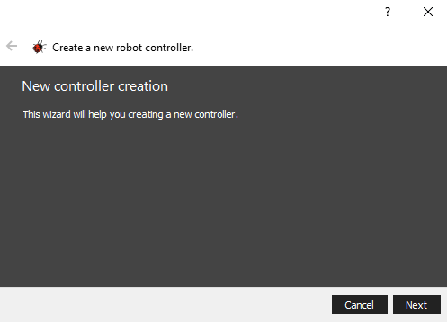<br><br>
Klikamy przycisk „Next” , a następnie wybieramy język programowania w którym będziemy tworzyć kod dla naszego robota (Uwaga! W przypadku gotowych robotów , warto użyć języka programowania który obsługuję robot. W innym wypadku program może się nie skompilować poprawnie). <br>
Klikamy przycisk „Next” , a następnie wybieramy język programowania w którym będziemy tworzyć kod dla naszego robota (Uwaga! W przypadku gotowych robotów , warto użyć języka programowania który obsługuję robot. W innym wypadku program może się nie skompilować poprawnie).<br>

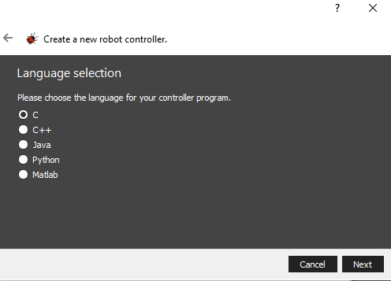

Klikając przycisk „Next” przechodzimy do etapu wyboru środowiska IDE w którym będziemy projektować kod, domyślnie wybrane IDE to „Webots”<br>


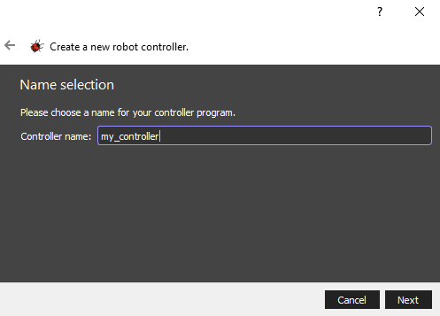<br>

Po nadaniu nazwy , etap tworzenia kontrolera zostaje zakończony. Mamy możliwość zakończenia kreatora z opcją automatycznego otwarcia naszego nowo przygotowanego kontrolera w edytorze tekstu.

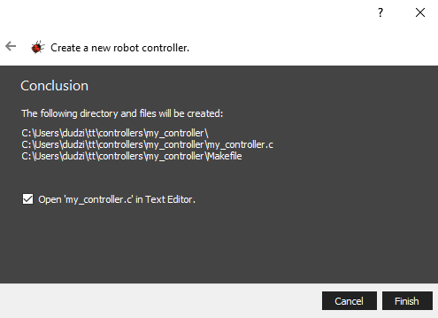<br><br>

<p style="text-allign: center;"><font size="4"><b>Standardowy kod jaki zostaje utworzony, to prosty wycinek który implementuję robota oraz jego podstawowe moduły:</font></b></p><br>
------------------------------------------------------------------------------------

**Może być konieczne dodanie takich bibliotek**
````C++
<webots/distance_sensor.h> or
<webots/motor.h>
````

````C++
#include <webots/robot.h>
#define TIME_STEP 64

````

**To jest główny program , agrumenty głównej funckcji są określone przez "controlerArgs" odnoszące się do węzła robota**
````C++
int main(int argc, char **argv) {
  //inicializacjq webotsów, niezbędne
  wb_robot_init();
````

**Należy tutaj zadeklarować zmienne WbDeviceTag do przechowywania tego typu urządzeń**

````C++
WbDeviceTag my_sensor = wb_robot_get_device("my_sensor");
WbDeviceTag my_actuator = wb_robot_get_device("my_actuator");
````

  **Główna pętla wykonuje kroki symulacji w milisekunadach i opuszcza pętle po zakończeniu**
  `````C++
  while (wb_robot_step(TIME_STEP) != -1) {
    //Zczytywanie sensorów
    // Wczytanie do funkcji danych z sensorów 
     double val = wb_distance_sensor_get_value(my_sensor);
     //wywołanie funkci wysłającej informacji do robota ustawiające jego pozycje
     wb_motor_set_position(my_actuator, 10.0);
    
  };
   // Czyszczenie zasobów webots
  wb_robot_cleanup();
  return 0;
  `````

---------------------------------------
<p style="text-indent: 30px;"><font size="3"><b>ii.	Implementacja kodu</font></b></p>
Domyślnie zostaję zaimplementowany standardowy kod oraz moduł wybranego robota. Od tego momentu mamy możliwość modyfikacji kodu dodając własne funkcję, metody oraz zmienne. Istnieję również możliwość wyczyszczenia naszego pliku kontrolera i zaimplementowanie wszystkich funkcji , zmiennych oraz metod ręcznie wg. naszych preferencji w pustym pliku.Musimy natomiast pamietać, aby programując robota używac już zdefiniowanych zmiennych modułów w dokumentacji Webots.


<font size="3"><b>c. Implementacja modułów</font></b> <br>

&nbsp;&nbsp;&nbsp;&nbsp;&nbsp;&nbsp;<font size="3"><b>i.	Standardowa biblioteka C++</font></b></p>

Moduł implementowany jest standardowo , przy jego braku należy go zaimplementować:
````C++
#include <stdio.h>
````
Oczywiście plik o nazwie „stdio.h” musi zawierać prawidłowe instrukcje źródłowe w języku C, które można skompilować jako część programu.Ten konkretny plik składa się z kilku standardowych # definicji w celu zdefiniowania niektórych standardowych operacji we / wy.
Plik nazywa się plikiem nagłówkowym, a na dyskach źródłowych dostarczonych z kompilatorem C znajdziemy kilka różnych plików nagłówkowych.

&nbsp;&nbsp;&nbsp;&nbsp;&nbsp;&nbsp;<font size="3"><b>ii.	Dystansu</font></b></p>
DistanceSensor można użyć do modelowania czujnika ogólnego, czujnika podczerwieni, czujnika sonaru lub dalmierza laserowego. Ta symulacja urządzenia jest wykonywana przez wykrywanie kolizji między jednym lub kilkoma promieniami czujnika i obiektami w otoczeniu. W przypadku typu ogólnego, sonaru i lasera kolizja zachodzi z obiektami ograniczającymi węzłów Solid, natomiast wykrywanie kolizji promieni podczerwonych wykorzystuje węzły Solid.<br>
Promienie węzłów DistanceSensor można wyświetlić, sprawdzając menu Widok / Opcjonalne renderowanie / Pokaż promienie czujnika odległości. Przejście czerwono-zielone na promieniach wskazuje punkty przecięcia z ograniczającymi obiektami.


````C++
Implementacja modułu odbywa się przez import:
#include <webots/distance_sensor.h>
````
&nbsp;&nbsp;&nbsp;&nbsp;&nbsp;&nbsp;<font size="3"><b>iii.	Led</font></b></p>
Moduł LED służy do modelowania diody elektroluminescencyjnej (LED). Światło wytwarzane przez diodę LED można wykorzystać do debugowania lub do celów informacyjnych. Kolor wynikowy jest stosowany tylko w pierwszym potomku węzła LED. Jeśli pierwsze dziecko jest węzłem Shape, pole emissiveColor swojego węzła Material lub PBRAppearance jest zmieniane. Jeśli pierwsze dziecko jest węzłem Światła, jego pole koloru zostanie zmienione. W przeciwnym razie, jeśli pierwsze dziecko jest węzłem Grupy, w tym węźle stosowane jest wyszukiwanie rekurencyjne w celu znalezienia pola koloru, które należy zmodyfikować, więc każdy węzeł Światła, Kształtu i Grupy jest zmieniany zgodnie z poprzednimi regułami. Jeśli chodzi o węzły Light, węzły LED akceptują tylko węzły PointLight i SpotLight jako dzieci. Należy pamiętać, że węzły Materiał i Światło, które zostaną automatycznie zmienione przez funkcję LED, nie mogą być węzłami UŻYJ.


````C++
Implementacja modułu odbywa się przez import:
#include <webots/led.h>
````
&nbsp;&nbsp;&nbsp;&nbsp;&nbsp;&nbsp;<font size="3"><b>iv.	Akcelerometr</font></b></p>

Akcelerometr może być używany do modelowania urządzeń akcelerometru, takich jak te powszechnie spotykane w mobilnej elektronice, robotach i urządzeniach wejściowych do gier. Węzeł akcelerometru mierzy siły reakcji przyśpieszone i grawitacyjne w 1, 2 lub 3 osiach. Może być używany na przykład do wykrywania upadku, kierunku góra / dół itp.

````C++
Implementacja modułu odbywa się przez import:
#include <webots/accelerometer.h>
````
&nbsp;&nbsp;&nbsp;&nbsp;&nbsp;&nbsp;<font size="3"><b>v.Kamera</font></b></p>
Moduł kamery służy do modelowania kamery pokładowej robota. Powstały obraz można wyświetlić w oknie 3D. W zależności od konfiguracji węzeł Camera może modelować kamerę liniową, typową kamerę RGB lub nawet rybie oko, które jest zniekształcone sferycznie.

````C++
Implementacja modułu odbywa się przez import:
#include <webots/camera.h>
````

&nbsp;&nbsp;&nbsp;&nbsp;&nbsp;&nbsp;<font size="3"><b>vi. Światła</font></b></p>
Moduł LightSensor służą do modelowania foto-tranzystorów, foto-diod lub innego rodzaju urządzeń, które mierzą natężenie światła w danym kierunku. Napromieniowanie reprezentuje padanie mocy <br>
promieniowania na powierzchnię w watach na metr kwadratowy [W / m²] i jest czasami nazywane intensywnością. Symulowane natężenie napromienienia jest obliczane przez dodanie natężenia napromieniowania wniesionego przez każde źródło światła (DirectionalLight, SpotLight i PointLight) na świecie. Następnie całkowite natężenie napromienienia jest mnożone przez filtr kolorów i wprowadzane do tabeli odnośników, która zwraca odpowiednią wartość zdefiniowaną przez użytkownika.Udział napromieniowania każdego źródła światła jest podzielony na bezpośredni i otoczenia. Bezpośredni wkład zależy od położenia i orientacji czujnika, położenia i kierunku źródeł światła oraz (opcjonalnie) od możliwej niedrożności źródeł światła. Wkład otoczenia ignoruje możliwe niedrożności i nie ma na nie wpływu orientacja czujnika ani kierunek źródła światła. Bezpośrednie i otoczenia wkłady lamp punktowych i punktowych są tłumione zgodnie z odległością między czujnikiem a światłem, zgodnie z określonymi współczynnikami tłumienia. Światło emitowane przez światło kierunkowe nie jest tłumione. Zobacz także opisy węzłów DirectionalLight, SpotLight i PointLight.
Należy pamiętać, że model oświetlenia Webots nie uwzględnia światła odbitego ani kolorów obiektów.

````C++
Implementacja modułu odbywa się przez import:
#include <webots/light_sensor.h>

````


&nbsp;&nbsp;&nbsp;&nbsp;&nbsp;&nbsp;<font size="3"><b>vii. Robota</font></b></p>

Najważniejszy moduł , bez którego nie zbudowalibyśmy naszego zadania. Dotyczy on bowiem konfiguracji i możliwości obsługi robota w środowisku Webots. 


````C++
Implementacja modułu odbywa się przez import:
#include <webots/robot.h>
````
&nbsp;&nbsp;&nbsp;&nbsp;&nbsp;&nbsp;<font size="3"><b>viii. Węzeł Silnikowy</font></b></p>
Istotny moduł , pozwalający na poruszanie się robota. Moduł ten jest modułem abstrakcyjnym (bez tworzenia instancji), którego klasami pochodnymi są RotationalMotor i LinearMotor. Klasy te można wykorzystać w symulacji mechanicznej do zasilania złącza, a tym samym wykonywania ruchu wzdłuż lub wokół jednej z jego osi. RotationalMotor może zasilać HingeJoint (odpowiednio Hinge2Joint), gdy jest ustawiony w polu urządzenia (odpowiednio urządzenia lub urządzenia 2) tych węzłów. Powoduje to ruch obrotowy wokół wybranej osi. Podobnie, silnik liniowy może zasilać SliderJoint, wytwarzając ruch przesuwny wzdłuż swojej osi

````C++
Implementacja modułu odbywa się przez import:
#include <webots/motor.h>
````


--------------------
<font size="3"><b>Implementacja zmiennych funkcji </font></b> <br>
&nbsp;&nbsp;&nbsp;&nbsp;&nbsp;&nbsp;<font size="3"><b>i. Poruszanie się robota w zależności od koloru linii/font></b></p>

**Zaprogramowanie robota pod kątem weryfikacji kolorów zaczynamy od deklaracji definicji kolorów:**

````C++
#define WHITE 0
#define RED 2
#define BLACK 1
#define GREEN 3
````
Następnie konfigurujemy zmienną lem_state oraz funkcję LineEnteringModule która będzie główną funkcją pozwalającą na weryfikację czy robot znajduję się na lini czy też z niej zboczył. 

**Zadeklarujemy ją w poniższy sposób:**
````C++
int lem_state;
````

**i zdefiniujemy w poniższy sposób:**

````C++
#define LEM_STATE_STANDBY 0
#define LEM_STATE_LOOKING_FOR_LINE 1
#define LEM_STATE_LINE_DETECTED 2
#define LEM_STATE_ON_LINE 3
````

**Teraz możemy przejść do konfiguracji funkcji LEM:**

````C++
void LineEnteringModule(int side){(declaration)}
````

**Jako (declaration) deklarujemy procedure weryfikacji poruszania po linii:**

````C++
int Side, OpSide, GS_Side, GS_OpSide;
 if (lem_reset)
    lem_state = LEM_STATE_LOOKING_FOR_LINE;
  lem_reset = FALSE;

````
**Incicujemy prędkość**

````C++
lem_speed[LEFT] = LEM_FORWARD_SPEED;
lem_speed[RIGHT] = LEM_FORWARD_SPEED;
````

**Jeśli zboczył na lewo , przesuń się na prawo**
````C++
  if (side == LEFT) 
````
**Główny kierunek - prawy po wykryciu przecięcia linii**
````C++
    Side = RIGHT;    
    OpSide = LEFT;
    GS_Side = GS_RIGHT;
    GS_OpSide = GS_LEFT;

````
**Jeśli zboczył na lewo i nie ma możliwości przesunąć się w prawo, skręć w lewo**
````C++
    Side = LEFT;  
    OpSide = RIGHT;
    GS_Side = GS_LEFT;
    GS_OpSide = GS_RIGHT;
  }
````
**Wewnątrz funkcji deklarujemy switch:**
````C++
 Switch({declaration})
 //Pod nazwą „declaration” definiujemy wcześniej utworzoną zmienna:
 Lem_state
  }
````
**Definiujemy Case - Warunek Podczas czuwania**
````C++
  case LEM_STATE_STANDBY: //Ruch kół ma być zablokowany/ w trybie nasłuchu
     			lem_active = FALSE; 
     			break;

````
**Definiujemy Case - Warunek poszukiwania lini**
````C++
  case LEM_STATE_LOOKING_FOR_LINE:
````
**Ustawiamy wartość sensora < 500**
````C++
     if (gs_value[GS_Side] < LEM_THRESHOLD) {
    lem_active = TRUE;
    
````
**Ustawiamy prędkość podczas wejścia na linie**
````C++
    lem_speed[OpSide] = LEM_FORWARD_SPEED;
    lem_speed[Side] = LEM_FORWARD_SPEED;  
````
**Do naszej zmiennej dodajemy warunek detekcji lini**
````C++
    lem_state = LEM_STATE_LINE_DETECTED;         
````
**Ustawiamy wartość sensora < 500**
````C++
    if (gs_value[GS_OpSide] < LEM_THRESHOLD)     
````
**Deklarujemy kolor czarny dla linii**
````C++
    cur_op_gs_value = BLACK; 
    lem_black_counter = 1;    
````
**W innym wypadku deklarujemy kolor biały**
````C++
    cur_op_gs_value = WHITE; 
    lem_black_counter = 0;
````
**Ustawiamy wartość sensora < 500**
````C++
    if (gs_value[GS_OpSide] < LEM_THRESHOLD) 
````
**Deklarujemy kolor czerwony dla linii**
````C++
   cur_op_gs_value = RED; 
   lem_red_counter = 1;
   //Kiedy kolor czerwony nie zostanie wykry sprawdź czy nie jest to biały
   cur_op_gs_value = WHITE; 
   lem_red_counter = 0;
````
**Wcześniejsza wartość sensora = obecna wartość sensora AKTUALIZACJA**
````C++
     prev_op_gs_value = cur_op_gs_value;
     break;
````
**Definiujemy Case – Warunek znalezienia linii**
````C++
    case LEM_STATE_LINE_DETECTED:
````
**Zapisujemy wartość czujnika naziemnego**
````C++
    if (gs_value[GS_OpSide] < LEM_THRESHOLD) 
````
**Wartość znaleziona to kolor czarny**
````C++
    cur_op_gs_value = BLACK;
    lem_black_counter++;
````
**Weryfikacja czy linia to nie kolor czerwony**
````C++
    cur_op_gs_value = RED; 
     lem_red_counter++;
````
**Weryfikacja czy linia to nie kolor zielony**
````C++
    cur_op_gs_value = GREEN; 
    lem_red_counter++;
````
**W przeciwnym razie to musi być kolor biały**
````C++
    cur_op_gs_value = WHITE;
````
**Utrzymywanie tempa na linii jeśli to kolor czarny , czerwony lub zielony**
````C++
    if (prev_op_gs_value == BLACK && cur_op_gs_value == WHITE)
    if (prev_op_gs_value == RED && cur_op_gs_value == WHITE)
    if (prev_op_gs_value == GREEN && cur_op_gs_value == WHITE)
````
**Jeśli robot wykryje kolor czarny, czerwony lub zielony , musi pozostać na linii:**
````C++
    lem_state = LEM_STATE_ON_LINE; 
````
**Deklarujemy prędkość**
````C++
    lem_speed[OpSide] = LEM_FORWARD_SPEED + LEM_K_GS_SPEED * (GS_WHITE - gs_value[GS_Side]);
    lem_speed[Side] = LEM_FORWARD_SPEED - LEM_K_GS_SPEED * (GS_WHITE - gs_value[GS_Side]);
````
**Definiujemy Case – Warunek pozostania na linii**
````C++
   case LEM_STATE_ON_LINE
````
**Po tak wykonanej deklaracji oraz zdefiniowaniu odpowiednio kolorów , nasz robot bez problemu wykonuję manewry oraz redukuję swoją prędkość w zależności od koloru napotkanej linii.**

--------------------------------------

&nbsp;&nbsp;&nbsp;&nbsp;&nbsp;&nbsp;<font size="3"><b>ii. Porsuzanie  robota wspieracjanego przez kamerę</font></b></p>
Kamera jest kluczowym dodatkiem który został dodany do robota typu epuck. Dzięki niej jesteśmy w stanie weryfikować świat znajdujący się przed robotem.
Obraz jaki uzyskujemy domyślnie to 52 × 39 RGB  z prędkością 4 klatek na sekundę. Bez koloru możemy zwiększyć do 8 klatek na sekundę. Nie więcej. Ale możesz także uzyskać inny rodzaj obrazu, na przykład linię pikseli kolorowych 480 x 1 na ziemi skierowaną w stronę robota.

**Procedurę obsługi kamery , zaczniemy od implementacji jej w kodzie:**
````C++
    WbDeviceTag cam;
    unsigned short width, height;
````
**Następnie kamerę uruchamiamy przez odpowiednio zdefiniowany kod:**
````C++
    cam = wb_robot_get_device("camera");
    wb_camera_enable(cam,TIME_STEP_CAM);
    width = wb_camera_get_width(cam);
    height = wb_camera_get_height(cam);
````
**Weryfikacja czy robota znajduję się na linii**
````C++
    int i;
    int *grey = (int *)malloc(sizeof(int)*width);
````
**Domyślna prędkość ustawiana jeśli robot jest na linii**
````C++
    int speed[2]={150,150};
    const unsigned char *image;
````
**Pobranie wartości z kamery**
````C++
    image = wb_camera_get_image(cam);
    for (i = 0; i < width; i++) {
    grey[i] = 255-wb_camera_image_get_grey(image, width, i, 0);
    //Numer 0 oznacza w tym przypadku kolor czarny
    //Kolor biały:255
    //Wykonując działanie arytmetyczne: 255-0=255
    //Otrzymujemy kolor szary który jest tablicą reprezentującą rewersje koloru białego i czarnego: grey[i] = black   
````
**Wykorzystanie modułów do interpretacji linii**
````C++
  lem(grey,width);
  lfm(grey, width);
  llm(grey, width);
````
**Wykorzystane wartości należy przesłać do siłowników**
````C++
  free(grey);
  return TIME_STEP;
````
**Moduły wykorzystane do interpretacji : LEM ,LFM , LLM**
**Przykład zdefiniowania modułu LEM:**
````C++
  void lem(int array[], int size){
  int *left   = (int *)malloc(sizeof(int)*size/10);
  int *right  = (int *)malloc(sizeof(int)*size/10);
  int *middle = (int *)malloc(sizeof(int)*size/10);
  int i;
  for (i=0;i<size/10;i++){
````
**Deklaracja tablicy wartości z lewej skrajnej dziesiątej najwyższego rzędu kamery**
````C++
    left[i]=array[i];
````
**Deklaracja tablicy wartości skrajnej prawej dziesiątej części najwyższego rzędu kamery**
````C++
    right[i]=array[size-1-i];
````
**Deklaracja tablicy wartości środkowej dziesiątej części kamery**
````C++
        middle[i]=array[size/2-size/20+i];
  }
  current_mean[0] = mean(left, size/10);
  current_mean[1] = mean(middle, size/10);
  current_mean[2] = mean(right, size/10);
  for (i=0;i<3;i++){
  if (current_mean[i]>previous_mean[i]+SENSIBILITY){  
````
**Jeśli każdy element linii jest wystarczająco czarny przypisujemy is_in[]=1**
````C++
          is_in[i]=1;
    }}
  if (is_in[0]||is_in[1]||is_in[2]){
    lfm_active=1
    //…  
  }
  free(left);
  free(right);
  free(middle);
}
````
**Przykład zdefiniowania modułu LFM:**
````C++
void lfm(int array[], int size){
  if (lfm_active){
    int delta = find_middle(array,size)-width/2;
    lfm_speed[LEFT]=MAX_DELTA*delta/size;
    lfm_speed[RIGHT]=-lfm_speed[LEFT];
	////give adjustments to default speed, speed[LEFT] and  speed[right]
  } else {
    lfm_speed[RIGHT]=lfm_speed[LEFT]=0;
  }
}
````
**Przykład zdefiniowania modułu LLM**

````C++
    void llm(int array[], int size){
  int i;
  for (i=0;i<3;i++){
    if (current_mean[i]<previous_mean[i]-SENSIBILITY){
      is_in[i]=0;
    }
    previous_mean[i]=current_mean[i];
  }
  if (!is_in[0]&&!is_in[1]&&!is_in[2]){
    lfm_active=0;
    //…  }
}
````
---------------
<font size="5"> 5.Dokumentacja</font><br><br>
&nbsp;&nbsp;&nbsp;&nbsp;&nbsp;&nbsp;<font size="3"><b>a.	Robot e-puck</font></b></p>
Pełną dokumentację robota można znaleźć na stronie producenta maszyny.

[cyberbotics e-puck dokumentacja](https://cyberbotics.com/doc/guide/epuck "cyberbotics page")

&nbsp;&nbsp;&nbsp;&nbsp;&nbsp;&nbsp;<font size="3"><b>b. Webots</font></b></p>
Pełną dokumentację można znaleźć na stronie producenta oprogramowania i środowiska Webots. 

[cyberbotics webots dokumentacja](https://cyberbotics.com/doc/reference/ "cyberbotics page")

### Filmy obrazujące jazdę na 3 torach

[Tor łatwy](https://youtu.be/9pRB_EiRPUY "cyberbotics page")

[Tor średnio-zaawansowany](https://youtu.be/EPfG9dZk4d4 "cyberbotics page")

[Tor zaawansownay](https://youtu.be/9pRB_EiRPUY "cyberbotics page")


